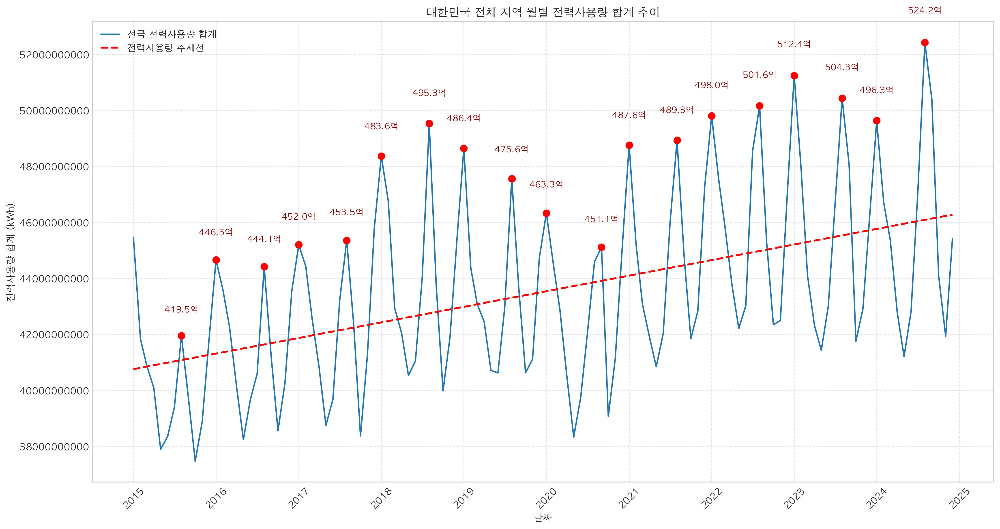
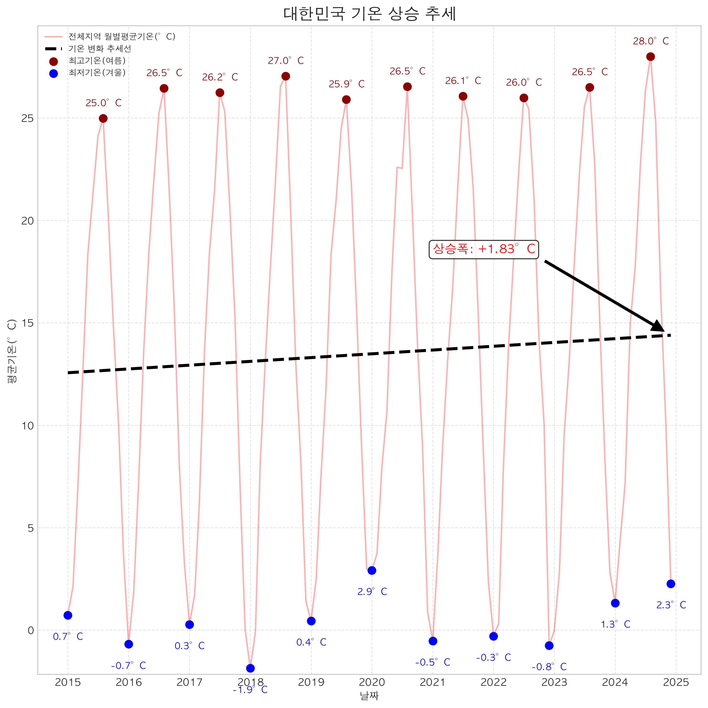

# SKN24-Mini-EDA-1Team

## Team ⚡️날씨요정 찌릿찌릿⚡️

|  |  |  |  |  |
|:---:|:---:|:---:|:---:|:---:|
| **정재훈** | **김은우** | **고아라** | **나혜린** | **박수영** |
| 발표/강원도 | 경상도 | 충청도 | 전라도 | 수도권 |
|  |  |  |  |  |
| | | | | |

---------------------
# 주제:[EDA] [날씨와 전력량의 비선형적 관계 분석]
by EDA_MINI_1TEAM
## 1. 프로젝트 개요
   - 본 프로젝트는 국내 시/도단위 전력 사용량 기상 데이터를 결합하여, 기후 요인이 전력수요 변화에 미치는 정량적 영향과 비선형적 패턴을 탐색하는 데 목적을 두고 있음.
   - 기간 : 2026.01.30 ~ 2025.02.04

## 2. 프로젝트 배경 및 필요성
- 2-1. 폭염·한파 시 냉·난방 전력 수요량이 매년 상승
   

- 2-2.기온과 전력 사용량의 연관은 사례를 통해 확인된다. 2025년 10월 제주의 날씨는 기온이 떨어지지 않아, 10월 들어 6일간 제주지역 하루 최대전력량이 800MW를 넘어섰다. 이는 기온이 전력 사용량에 큰 영향을 주는 것이라고 판단된다 *출처 : 제주의소리(https://www.jejusori.net)

## 3. 프로젝트 방향성 : 
1. 계약종별 전력소비량 확인: 가동 주체별(가정·일반·산업용 등) 전력량 비중과 날씨 민감도는 어떻게 다른가?
2. 전력소비량과 기상 변수의 상관관계 확인: 기온 외에 기압, 습도, 풍속 등은 전력 사용량과 어떤 상관관계를 갖는가?
3. 비선형 구조 탐색: 기상 조건에 따라 전력 수요가 불연속적으로 변하는 지점은 어디인가?
 
## 4. 데이터 전처리 과정 및 전반적인 프로세스
  - 전반적인 프로세스 : 공공데이터 전처리 → 상관관계 분석(선형성) → 일반화선형모형(비선형 및 전력사용량의 꼬리분포에 영향을 미치는 날씨 요인 확인)
  -  결측치/이상치 처리 후 상관분석, 시각화 (히트맵, 박스플롯..) 등을 통해 계절, 지역, 용도 (가정용/일반용/산업용)
  - 본 프로젝트는 각종 날씨 데이터(기온, 습도, 강수량 등)와 전력 수요가 어떤 영향 관계가 있는지 확인함

기사 링크 및 데이터 출처
[kbs뉴스] "‘2018년 이후 역대급 더위’ 8월, 주택 전기사용량 역대 최대" : https://news.kbs.co.kr/news/pc/view/view.do?ncd=7793279
[제주의소리] "‘한치에 에어컨까지’ 제주 초유의 10월 전력 800MW" : [https://www.jejusori.net](https://www.jejusori.net/news/articleView.html?idxno=440240)
[헌국전력] 시군구별 전력 판매량 정보제공 https://www.kepco.co.kr/home/customer/library/electricity-statistics/sales-volume/boardList.do
[기상자료개방포털] 종관기상관측(ASOS) https://data.kma.go.kr/data/grnd/selectAsosRltmList.do?pgmNo=36
---------------------

## 간단한 그래프 보기

### 1. 대한민국 전체 지역 월별 전력사용량 합계 추이

#### 그래프 해석
* **지속적인 상승 추세**: 2015년부터 2024년까지의 데이터를 보면, 붉은색 점선(추세선)이 우상향하고 있어 **전국 전력 사용량이 매년 꾸준히 증가**하고 있음을 알 수 있습니다.
* **계절적 변동성**: 매년 여름(8월)과 겨울(1월)에 전력 사용량이 급증하는 **V자형 패턴**이 반복됩니다. 특히 여름철 냉방 수요와 겨울철 난방 수요가 전력 피크의 주요 원인으로 가정을 해볼 수 있겠습니다.
* **역대 최고치 경신**: 2024년 여름, 전력 사용량이 **524.2억 kWh**를 기록하며 관측 기간 중 가장 높은 수치를 보였습니다.

---

### 2. 대한민국 기온 상승 추세 (평균기온)

#### 그래프 해석
* **뚜렷한 기온 상승**: 검은색 점선(기온 변화 추세선)을 통해 지난 10년간 대한민국의 **평균 기온이 약 1.83°C 상승**했음을 확인할 수 있습니다.
* **여름철 고온 현상 심화**: 2015년 최고 평균기온인 25.0°C에 비해, 2024년에는 **28.0°C**까지 치솟으며 여름이 점점 더 뜨거워지고 있습니다.
* **전력 사용량과의 상관관계**: '전력사용량 추이' 그래프와 비교했을 때, 최고 기온이 발생하는 시점과 전력 사용량 피크 시점이 일치합니다. 이는 **기온 상승이 직접적으로 전력 수요 급증을 유발**한다고 가정해 볼 수 있습니다.
* 10년 사이에 연평균 기온이 크게 상승했는데 이는 24년이 113년 관측 역사상 가장더운 한해로 역대 최고 기록을 14.5°C로 경신했기 때문입니다.
* 출처 : https://www.kma.go.kr/kma/news/press.jsp?mode=view&num=1194448

---------------------
## 기술 스택

| 분류 | 기술/도구 |
| :--- | :--- |
| **언어** |  |
| **협업 툴** |  
| **데이터 처리** |  
| **데이터 시각화** |  

---------------------

## 지역별 전력사용량과 기상요인 상관관계 분석
<table width="100%">
  <tr>
    <td width="50%">
      
    </td>
    <td width="50%">
      
    </td>
  </tr>
</table>

</table>

- 서울: 냉방도일과 수증기기압이 각각 0.61, 0.38로 뚜렷한 양적 상관관계를 보임. 일조율은 -0.32로 뚜렷한 음의 상관관계를 보임.

- 경인: 냉방도일이 0.31로 뚜렷한 양적 상관관계를 보임. 나머지 기상요인들은 약한 상관관계를 보임.

<table width="100%">
  <tr>
    <td width="50%">
      
    </td>
    <td width="50%">
      
    </td>
  </tr>
</table>

</table>

- 강원도: 평균풍속이 0.28로 약한 상관관계를 보임. 나머지 기상요인과 전력 사용량은 거의 상관관계가 없음.

- 충청도: 평균풍속이 0.34로 뚜렷한 양적 상관관계를 보임. 평균풍속을 제외한 나머지 기상요인과 전력 사용량은 거의 상관관계가 없음.

<table width="100%">
  <tr>
    <td width="50%">
      
    </td>
    <td width="50%">
      
    </td>
  </tr>
</table>

</table>

- 경상도: 평균풍속과 평균현지기압이 각각 0.22, 0.21로 약한 양적 상관관계를 보임. 나머지 기상요인과 전력 사용량은 거의 상관관계가 없음.
  
- 전라도: 냉방도일이 0.12로 약한 양적 상관관계를 보임. 나머지 기상요인과 전력 사용량은 거의 상관관계가 없음.

## 날씨 데이터 컬럼 설명

| 컬럼명 | 설명 |
|--------|------|
| 평균기온(°C) | 해당 지점의 하루 평균 기온 |
| 평균현지기압(hPa) | 해당 지점의 하루 평균 기압(지점 기준) |
| 평균해면기압(hPa) | 해당 지점의 하루 평균 해면 기준 기압 |
| 평균수증기압(hPa) | 공기 중 수증기가 주는 압력 |
| 평균상대습도(%) | 공기 중 수분 함량 비율 |
| 월합강수량(00~24h만)(mm) | 하루 합계 강수량을 월 단위로 합산한 값 |
| 평균풍속(m/s) | 하루 평균 풍속 |
| 일조율(%) | 하루 중 햇빛이 비친 시간 비율 |
| 최심적설(cm) | 하루 중 가장 깊은 적설(눈 깊이) |
| 평균지면온도(°C) | 하루 평균 지면 온도 |
| CDD | 냉방도일 – 냉방 필요 정도를 나타내는 지표 |
| HDD | 난방도일 – 난방 필요 정도를 나타내는 지표 |

<small>CDD (Cooling Degree Day, 냉방도일) = $\max(T_\text{평균} - 24, 0)$</small>  
<small>HDD (Heating Degree Day, 난방도일) = $\max(18 - T_\text{평균}, 0)$</small>

## 전력사용량 데이터 컬럼 설명
| 계약종별 | 설명 |
|----------|------|
| 가로등 | 가로등, 도로 조명용 전력 |
| 교육용 | 학교, 학원 등 교육기관에서 사용하는 전력 |
| 농사용 | 농업용 전력, 예: 온실, 급수 펌프 등 |
| 산업용 | 공장, 제조업 등 산업체에서 사용하는 전력 |
| 심야 | 심야 시간대(보통 23:00~07:00)에 사용하는 전력 |
| 일반용 | 상점, 사무실 등 일반 상업용 전력 |
| 주택용 | 가정에서 사용하는 전력 |
| 합계 | 위 모든 계약종별을 합산한 총 전력 사용량 |

---------------------
## 4. 한계점:
  - 데이터 해상도: 시·도 단위 공공 데이터를 활용하여 개별 가구·건물의 세밀한 소비 행태 분석에는 제한이 있음.
  - 변수의 한정성: 전기요금, 경제지표 등 비기상 요인을 제외하고 기상 변수(기온·습도 등)에 집중함
  - 시간적 범위: 단기 데이터 분석으로, 장기적 기후변화 추세로 일반화하기에는 한계가 있음.
  - 분석의 지향점: 신규 알고리즘 개발보다 EDA와 기초 통계 모델을 통한 직관적 패턴 탐색 및 검증에 주력함.
  

